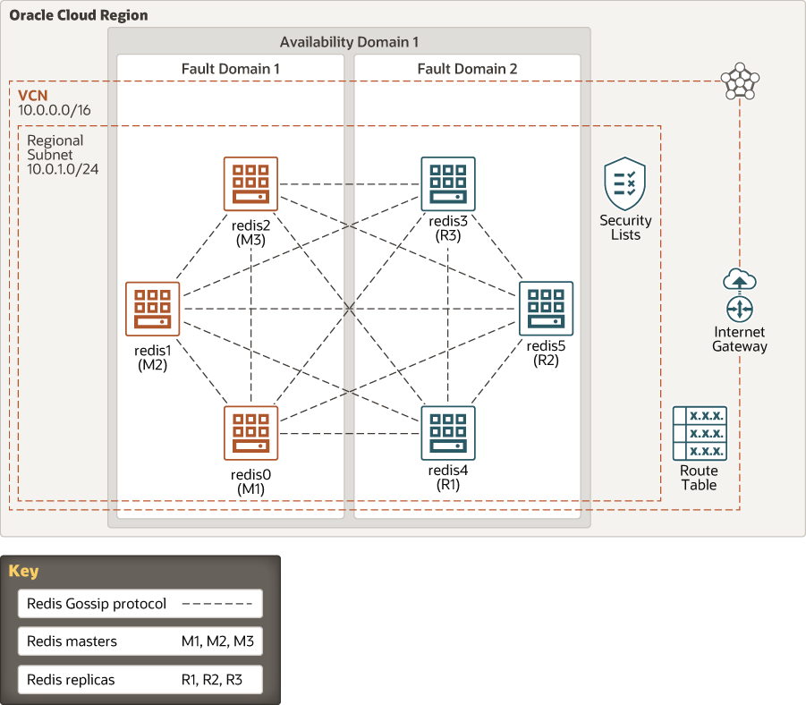

# terraform-oci-arch-redis

Redis is an open source, in-memory data structure store that is used as a database, cache, and message broker. It supports data structures such as strings, hashes, lists, sets, sorted sets with range queries, bitmaps, HyperLogLogs, geospatial indexes with radius queries, and streams.

This reference architecture shows a typical six-node deployment of a Redis cluster on Oracle Cloud Infrastructure Compute instances.

For details of the architecture, see [_Deploy a highly available, distributed cache using Redis_](https://docs.oracle.com/en/solutions/deploy-redis-cluster/index.html)

## Architecture Diagram



## Prerequisites

- Permission to `manage` the following types of resources in your Oracle Cloud Infrastructure tenancy: `vcns`, `internet-gateways`, `route-tables`, `security-lists`, `subnets`, `autonomous-database-family`, and `instances`.

- Quota to create the following resources: 1 VCN, 1 subnets, 1 Internet Gateway, 1 NAT Gateway, 1 route rules, and 6 compute instance.

If you don't have the required permissions and quota, contact your tenancy administrator. See [Policy Reference](https://docs.cloud.oracle.com/en-us/iaas/Content/Identity/Reference/policyreference.htm), [Service Limits](https://docs.cloud.oracle.com/en-us/iaas/Content/General/Concepts/servicelimits.htm), [Compartment Quotas](https://docs.cloud.oracle.com/iaas/Content/General/Concepts/resourcequotas.htm).

## Deploy Using Oracle Resource Manager

1. Click [](https://cloud.oracle.com/resourcemanager/stacks/create?region=home&zipUrl=https://github.com/oracle-devrel/terraform-oci-arch-redis/releases/latest/download/terraform-oci-arch-redis-stack-latest.zip)


    If you aren't already signed in, when prompted, enter the tenancy and user credentials.

2. Review and accept the terms and conditions.

3. Select the region where you want to deploy the stack.

4. Follow the on-screen prompts and instructions to create the stack.

5. After creating the stack, click **Terraform Actions**, and select **Plan**.

6. Wait for the job to be completed, and review the plan.

    To make any changes, return to the Stack Details page, click **Edit Stack**, and make the required changes. Then, run the **Plan** action again.

7. If no further changes are necessary, return to the Stack Details page, click **Terraform Actions**, and select **Apply**.

## Deploy Using the Terraform CLI

### Clone the Module
Now, you'll want a local copy of this repo. You can make that with the commands:

    git clone https://github.com/oracle-devrel/terraform-oci-arch-redis.git
    cd terraform-oci-arch-redis
    ls

### Set Up and Configure Terraform

1. Complete the prerequisites described [here](https://github.com/cloud-partners/oci-prerequisites).

2. Rename `provider.tf.cli` to `provider.tf`

3. Create a `terraform.tfvars` file, and specify the following variables:

```
# Authentication
tenancy_ocid         = "<tenancy_ocid>"
user_ocid            = "<user_ocid>"
fingerprint          = "<finger_print>"
private_key_path     = "<pem_private_key_path>"

# Region
region = "<oci_region>"

# Compartment
compartment_ocid = "<compartment_ocid>"

````
### Create the Resources
Run the following commands:

    terraform init
    terraform plan
    terraform apply

### Destroy the Deployment
When you no longer need the deployment, you can run this command to destroy the resources:

    terraform destroy

## Deploy as a Module
It's possible to utilize this repository as remote module, providing the necessary inputs:

```
module "terraform-oci-arch-redis" {
  source                           = "github.com/oracle-devrel/terraform-oci-arch-redis"
  tenancy_ocid                     = "<tenancy_ocid>"
  user_ocid                        = "<user_ocid>"
  fingerprint                      = "<user_ocid>"
  region                           = "<oci_region>"
  private_key_path                 = "<private_key_path>"
}
```

Argument | Description
--- | ---
tenancy_ocid | OCI Tenancy OCID for Terraform's OCI authentication.
user_ocid | OCI User's OCID used for Terraform's OCI authentication.
fingerprint | OCI User's fingerprint for Terraform's OCI authentication.
region | OCI Region for Terraform's OCI authentication.
compartment_ocid | Compartment's OCID where Redis will be provisioned.
availability_domain_name | The Availability Domain Name for Redis deployment.
availability_domain_number | The Availability Domain Number for Redis deployment.
use_existing_vcn | If you want to inject already exisitng VCN then you need to set the value to TRUE.
VCN-CIDR | You can define CIDR block for VCN (only when use_existing_vcn=FALSE).
Subnet-CIDR | You can define CIDR block for Subnet (only when use_existing_vcn=FALSE).
vcn_id | If use_existing_vcn is set to TRUE then you can pass VCN OCID and module will use it to create Redis installation.
use_redis_oci_logging | If you want to enable OCI Logging for Redis then set to TRUE (be default FALSE).
redis_subnet_id | If use_existing_vcn is set to TRUE then you can pass Redis Subnet OCID and module will use it to create Redis installation.
use_private_subnet | If you want to nest Redis in private subnet then set to TRUE.
use_bastion_service | If you want to use OCI Bastion Service then you need to set the value to TRUE.
inject_bastion_service_id | Instead of counting on module to create Bastion Service you can pass Bastion Service OCID as input (set value to TRUE).
bastion_service_id | If inject_bastion_service_id is set to TRUE then you can pass here Bastion Service OCID as input.
inject_bastion_server_public_ip  | Instead of counting on module to create Bastion VM you can pass Bastion Host Public IP Address as input (set value to TRUE).
bastion_server_public_ip | If inject_bastion_server_public_ip is set to TRUE then you can pass here Bastion Host Public IP Address.
numberOfMasterNodes | You can define number of Master nodes (for Sentinel monitoring bare minimum is 1).
numberOfReplicaNodes | You can define number of Replica nodes (for Sentinel monitoring bare minimum is 2).
cluster_enabled | If you want to use Redis cluster (in-memory sharding) then you can set it to TRUE. In that case you need to have numberOfMasterNodes=3 and numberOfReplicaNodes=3 (bare minimum).
redis-prefix | Prefix for VM node's name (default="redis")
redis_version | Version of Redis.
redis_port1 | Port1 for Redis (default=6379).
redis_port2 | Port1 for Redis (default=16379).
sentinel_port | Port for Sentinel (default=26379).
ssh_public_key | SSH Public key.
instance_os | Operating system for compute instances (default="Oracle Linux").
linux_os_version | Operating system version for all Linux instances (defaulf="7.9").
instance_shape | Instance Shape (default="VM.Standard.E4.Flex").
instance_flex_shape_ocpus | For Flex shapes OCPU (default=1).
instance_flex_shape_memory  | For Flex shapes memory in GB (default=10).
add_iscsi_volume | If you want to deploy Redis on attached iSCSI disk (block volume) then set the value to TRUE.
iscsi_volume_size_in_gbs | If add_iscsi_volume=TRUE then you can define the size of the iSCSI block volume (default=100).

## Contributing
This project is open source.  Please submit your contributions by forking this repository and submitting a pull request!  Oracle appreciates any contributions that are made by the open source community.

### Attribution & Credits
Initially, this project was created and distributed in [GitHub Oracle QuickStart space](https://github.com/oracle-quickstart/oci-redis). For that reason, we would like to thank all the involved contributors enlisted below:
- Oguz Pastirmaci (https://github.com/OguzPastirmaci)
- Lukasz Feldman (https://github.com/lfeldman)
- Pinkesh Valdria (https://github.com/pvaldria)
- Ben Lackey (https://github.com/benofben)
- Claudio Di Vita (https://github.com/cdivita) 
- J Collin Poczatek (https://github.com/cpoczatek)
- Sanjay Narvekar (https://github.com/NarvekarS)

## License
Copyright (c) 2021 Oracle and/or its affiliates.

Licensed under the Universal Permissive License (UPL), Version 1.0.

See [LICENSE](LICENSE) for more details.

